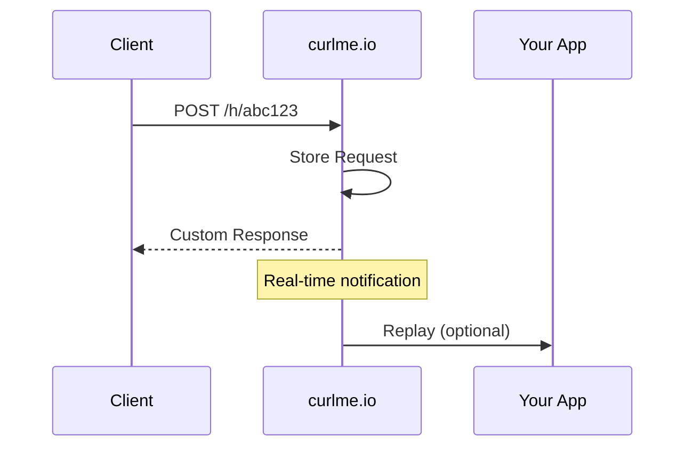

curlme is a terminal-first HTTP request debugging tool. This guide covers the core concepts you'll encounter while using curlme to capture, inspect, replay, and diff HTTP requests.

## Bins

A **Bin** is a unique HTTP endpoint that captures and stores incoming requests. Think of it as a mailbox for webhooks and API calls.

<Card title="Key Properties" icon="inbox">
- **Public ID**: A unique identifier used in URLs (e.g., `abc123xyz`)
- **Endpoint URL**: `https://curlme.io/h/{publicId}`
- **Custom Response**: Configure what the bin returns
- **Response Rules**: Conditional response logic
</Card>

### Bin Types

| Type | Description | Retention |
| ---- | ----------- | --------- |
| **Personal** | Owned by your account | Configurable |
| **Organization** | Shared with team members | Configurable |
| **Temporary** | Anonymous, no account needed | 24 hours |

## Requests

Every HTTP request sent to a bin is captured as a **Stored Request**.

### Captured Data

```json
{
  "id": "clx1234567890",
  "binId": "clx0987654321",
  "method": "POST",
  "path": "/webhooks/stripe",
  "headers": {
    "content-type": "application/json",
    "stripe-signature": "t=1234..."
  },
  "query": {
    "source": "production"
  },
  "body": "{\"event\": \"payment.completed\"}",
  "contentType": "application/json",
  "ip": "192.168.1.1",
  "timestamp": 1706745600000,
  "size": 156
}
```

### Request Lifecycle



## Organizations

**Organizations** enable team collaboration with shared bins and access control.

### Roles

| Role | Permissions |
| ---- | ----------- |
| **Owner** | Full access, can delete organization |
| **Admin** | Manage bins and members |
| **Member** | View and create bins |

### Personal Organization

Every user automatically gets a **Personal Organization** that contains their individual bins. This cannot be deleted.

## Response Rules

**Response Rules** allow dynamic responses based on request conditions.

```json
{
  "name": "Error for invalid tokens",
  "enabled": true,
  "priority": 1,
  "conditions": {
    "header": {
      "key": "authorization",
      "value": "invalid"
    }
  },
  "response": {
    "statusCode": 401,
    "headers": {},
    "body": "{\"error\": \"Unauthorized\"}",
    "contentType": "application/json"
  }
}
```

### Condition Types

- **Method**: Match specific HTTP methods
- **Path**: Match URL paths (supports wildcards)
- **Header**: Match header key-value pairs
- **Query**: Match query parameter values

## API Keys

**API Keys** authenticate CLI and API requests. They are prefixed with `cm_` for easy identification.

```
cm_a1b2c3d4e5f6g7h8i9j0k1l2m3n4o5p6q7r8s9t0u1v2w3x4y5z6
```

<Warning>
  API keys grant full access to your account. Keep them secure and never commit them to version control.
</Warning>

## Webhooks vs Hooks

| Term | Meaning |
| ---- | ------- |
| **Webhook** | An HTTP callback from an external service |
| **Hook Endpoint** | Your bin's URL at `/h/{binId}` |
| **Hook Request** | A captured incoming request |

## Data Retention

| Account Type | Default Retention | Max Retention |
| ------------ | ----------------- | ------------- |
| Free | 7 days | 7 days |
| Pro | 30 days | 90 days |
| Team | 30 days | Unlimited |

Configure retention per-bin via the dashboard or API.
