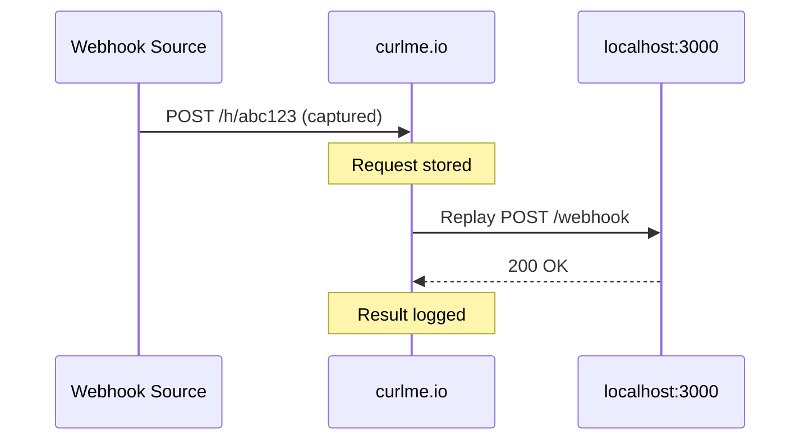

## Overview

Request Replay allows you to forward any captured request to a target URL, typically your local development server. This is invaluable for:

- **Debugging webhooks**: Replay production webhooks against local code
- **Testing**: Verify your endpoint handles requests correctly
- **Development**: Work with real request data locally

## How It Works



## CLI Replay

### Basic Usage

Replay the latest request to localhost:3000:

```bash
curlme replay
```

### Specify Target URL

```bash
curlme replay --to http://localhost:8080
```

### Replay Specific Request

Use the request ID (shown in `curlme listen`):

```bash
curlme replay rq_f8a3b2
```

Or the full ID:

```bash
curlme replay clx1234567890abcdef
```

### Complete Example

```bash
curlme replay rq_f8a3b2 --to http://localhost:3000/api/webhooks
```

Output:
```
✔ Replayed rq_f8a3b2
────────────────────────────────────────
Target    http://localhost:3000/api/webhooks
Status    200
Duration  45ms
```

## API Replay

Replay via the REST API:

```bash
curl -X POST https://curlme.io/api/replay \
  -H "x-api-key: cm_your_api_key" \
  -H "Content-Type: application/json" \
  -d '{
    "method": "POST",
    "url": "http://localhost:3000/webhooks",
    "headers": {
      "content-type": "application/json",
      "stripe-signature": "t=1234,v1=abc..."
    },
    "body": "{\"event\": \"payment.completed\"}"
  }'
```

### Response

```json
{
  "status": 200,
  "statusText": "OK"
}
```

### Error Response

```json
{
  "error": "Request timed out"
}
```

## Interactive Replay

When running `curlme listen`, press **R** to instantly replay the latest request:

```
→ Listening on abc123xyz (active)
  Waiting for requests…

→ POST   /webhooks          200    156B  rq_f8a3b2

  ── Replaying latest ──
✔ Replayed rq_f8a3b2
Target    http://localhost:3000/
Status    200
Duration  32ms
```

## What Gets Replayed

The replay includes:

| Property | Included |
| -------- | -------- |
| HTTP Method | ✅ Yes |
| Path | ✅ Yes |
| Headers | ✅ Yes (filtered) |
| Query Params | ✅ Yes |
| Body | ✅ Yes |

### Filtered Headers

Some headers are automatically excluded or modified:

- `host` - Set to target host
- `content-length` - Recalculated

### Added Headers

The replay adds:

```
x-replayed-by: curlme
```

## Common Use Cases

### Stripe Webhooks

```bash
# Start listening for Stripe webhooks
curlme listen

# In another terminal, trigger a Stripe event
stripe trigger payment_intent.succeeded

# Replay the captured webhook
curlme replay --to http://localhost:3000/api/stripe/webhook
```

### GitHub Webhooks

```bash
# Configure GitHub to send webhooks to your bin
# https://curlme.io/h/abc123

# When a push event arrives, replay it locally
curlme replay rq_latest --to http://localhost:3000/api/github
```

### Debugging Production Issues

```bash
# 1. Set up production webhook to forward to curlme.io
# 2. Wait for the problematic request
# 3. Replay against local debugger
curlme replay rq_problematic --to http://localhost:3000
```

## Timeout

Replay requests have a **30-second timeout**. If your endpoint takes longer, you'll receive:

```json
{
  "error": "Request timed out"
}
```

## Security Notes

<Warning>
  **Never replay requests to production systems** unless you understand the consequences. Some webhooks trigger irreversible actions.
</Warning>

<Tip>
  Use replay for local development and testing environments only.
</Tip>
